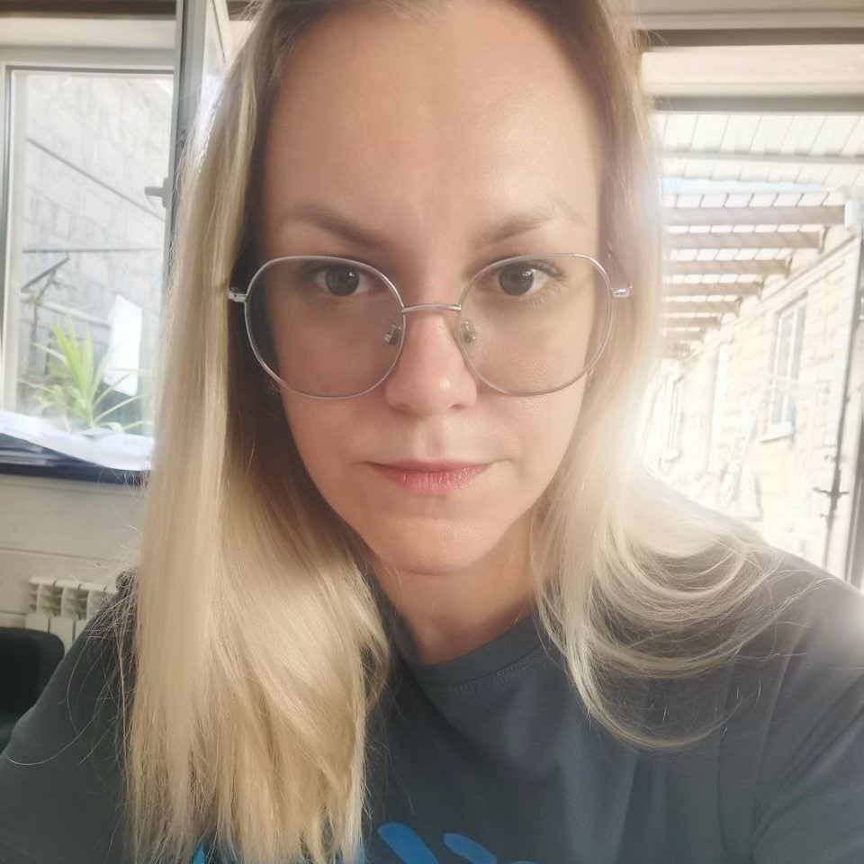

# Daria Evstratova
  
## My Contact Info:

**Phone:** +7 988 852-60-06

**E-mail:** d.melnitsa@yandex.ru

**GitHub:** [Pupocka](https://github.com/Pupocka)

**CodePen:** [Pupocka](https://www.codewars.com/users/Pupocka)

**Discord:** Pupocka

## About Me
I am 30 years old, I have worked with people a lot of time. An engineer by training, but never worked in this direction.
I'm here because I want to make a change in my life.
My goal is to gain knowledge in the field of front-end development.
  
## My strengths:
* Quick learner
* Flexibility, willingness to change
* Initiative
* Diligence
 
## Skills

* HTML5, CSS3
* JavaScript Basics
* Git, GitHub
* VS Code

## Code Example

  
```javascript
function boolToWord( bool ){
    if (bool == true) {
	  return ('Yes');

  } if (bool == false) {
      return ('No');
}
}

  ```

## Education

North Caucasus State University
  
## Languages

Russian - native speaker.

English - A2 (B1 in process…)